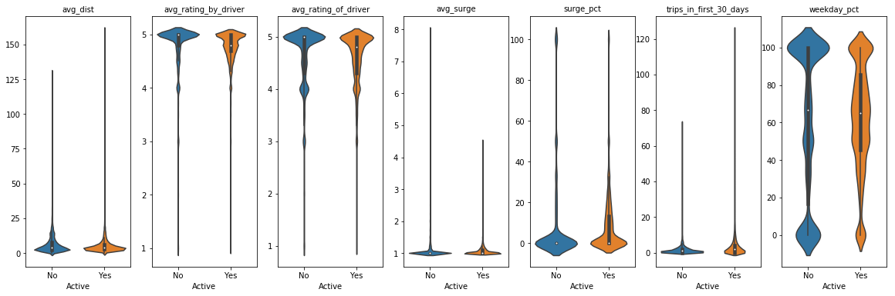
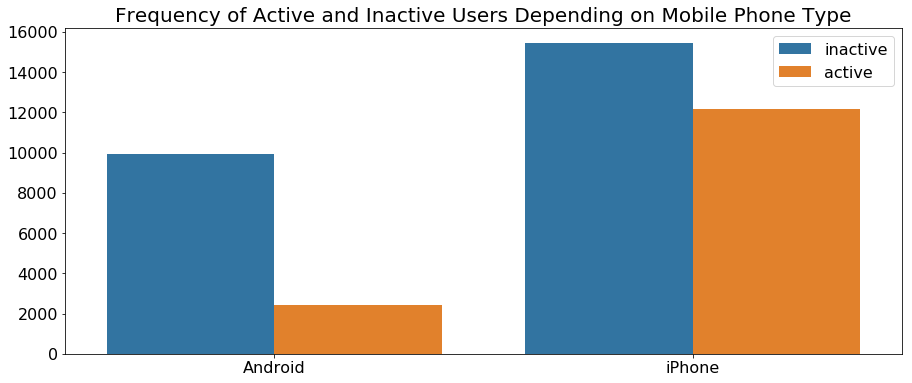
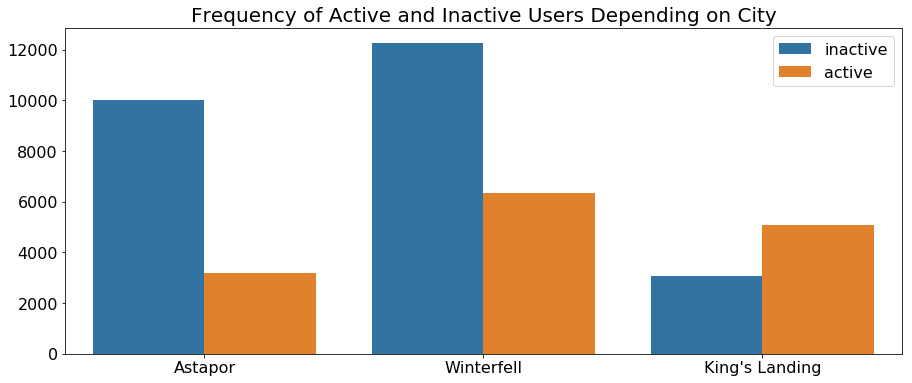
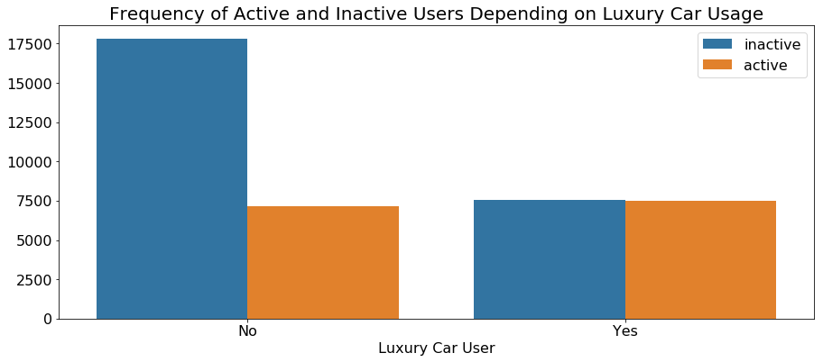
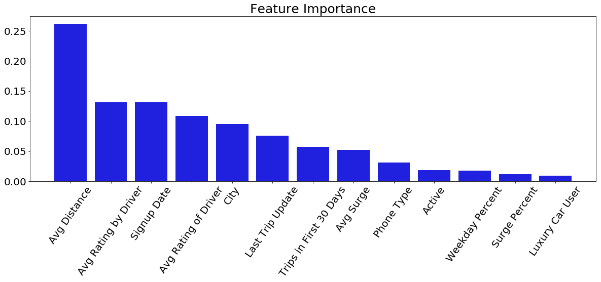

# Predicting Customer Retention Case Study

# Table of contents
1. [Motivation](#motivation)
2. [Data](#data)
3. [Feature Engineering](#feature_engineering)
4. [Exploratory Data Analysis](#EDA)
5. [Feature Importance](#featureimportance)
6. [Methods](#methods)
7. [Plans to Increase Retention](#increaseretention)
8. [Future Direction](#futuredirection)
9. [References](#references)

## Motivation 

This project was done as a case study while I was a Data Science Immersive student
at Galvanize in Denver, CO.  The objective was to create a model that would predict
customer retention for a ride-sharing company using their data on users
provided over a six month period.  Using the model, I was tasked with determining
which features were most influential in loss of retention and then making a plan
for how the company could use this information to increase retention.

## Data 

Here is a detailed description of the data received on each user:

* `city`: city this user signed up in phone: primary device for this user
* `signup_date`: date of account registration; in the form `YYYYMMDD`
* `last_trip_date`: the last time this user completed a trip; in the form `YYYYMMDD`
* `avg_dist`: the average distance (in miles) per trip taken in the first 30 days after signup
* `avg_rating_by_driver`: the rider’s average rating over all of their trips
* `avg_rating_of_driver`: the rider’s average rating of their drivers over all of their trips
* `surge_pct`: the percent of trips taken with surge multiplier > 1
* `avg_surge`: The average surge multiplier over all of this user’s trips
* `trips_in_first_30_days`: the number of trips this user took in the first 30 days after signing up
* `luxury_car_user`: TRUE if the user took a luxury car in their first 30 days; FALSE otherwise
* `weekday_pct`: the percent of the user’s trips occurring during a weekday

## Feature Engineering 

The data was pulled on July 1, 2014; it captures a six month period for users who
created an account in January 2014.  The company considers a user retained, or active,
if they used the ride-sharing company anytime in the 30 days before the data was
pulled; otherwise, the user is considered inactive, and not retained as a customer.  

Since I will be building a model to predict retention, I first had to create a column
for our target variable of retention that indicated whether or not a customer was
active based on if their last trip date was before or after June 1st, 2014.  

We found there were a large number of nulls, especially in the rating columns, which
makes sense considering riders are not required to rate their drivers.  We decided
to fill them using MICE, from the fancyimpute library; MICE is an iterative algorithm
based on chained equations that uses an imputation model specified separately for
each variable and involving the other variables and predictors.  MICE has shown to
be a better method for filling nulls than just replacing the nulls with the mean.

## Exploratory Data Analysis through Visualizations 

I knew that visualizing the data would help me to find patterns amongst the features.
The first violin plot in the diagram below tells us that there are more outliers in the active population for average distance traveled; these users potentially
stay active because they can use the ride-sharing company when on a business trip
that requires the user to fly into a distant airport.  In the second and third plots,
you can see that the inactive members are not necessarily inactive because of a dissatisfaction with their driver or a poor rating by their driver.  In the fourth
plot, there are more outliers amongst the inactive users for avg_surge(the average
surge level ridden duing a surge time); this suggests those customers only used
it in a bind, as most active users avoid riding when there's a high surge;
still the fifth plot shows that active users on average had a higher
percentage of surge rides than inactive users.  The sixth plot tells us that the
active members use the service often, especially the outliers, who took 120 trips
in the first 30 days. In the seventh plot, I noticed that inactive members were much more likely to use it only during the weekdays or only during the weekends; one can imagine that they might be inactive since they only used it when other transportation was not available.   

You can see in the countplot below, the population of people using the service mostly have iPhones; Android users aren't using the service either because it's not easy
to access on an Android, not well marketed to Android users, or simply because more people have iPhones than Androids.  

The real names of the cities in our data were replaced in order to conceal identity; still you can see from the countplot below that King's Landing is having much greater success in retaining its users than Astapor and Winterfell, even though the latter cities had many more users over the past six months.  To better understand why Astapor only retained about 25% of their customers from the past six months, we'd need take
a closer look at the demographics of Astapor and the ride-sharing marketing strategies
 in that city compared to King's Landing.  

The plot below shows that half of the users who were luxury car users are now inactive,
while 70% of the users who were not luxury car users are now inactive.

## Feature Importance 

To get an idea of which features are most important, I fit the data to a Random
Forest Classifier model, and used the feature importance method on my model to find
that the top five most important features in determining whether or not a user was
active in the last 30 days were:

1. Average Distance Traveled
2. Weekday Percent
3. Average Rating of Driver
4. Average Rating by Driver
5. Surge Percent

Looking back at the exploratory data analysis, we saw that for the most part active
users had a lower average distance than non-active users, less predictable weekday
usage than non-users, and that active users overall had lower ratings both by the
driver and for the driver.  While we wouldn't expect these to be characteristics
of an active user, we did see from the graphs that they are defining characteristics
of the average user; therefore it makes sense that these features are most influential
in determining if a user is active or not active.

You can see in the graph below that average distance traveled is by far the most
influential feature in determining retention for a customer.

## Methods 

To determine the model that would best predict whether a user was currently active
or non-active, we decided to check the average cross validation scores
on many popular classification algorithms that we thought would be relevant considering
the data.

To determine the scoring metric upon which we will evaluate our models, one has
to consider the context of the problem in terms of what we stand to lose with our
correct and incorrect predictions.  In this case, a confusion matrix would contain
the following:

* TP - correctly predicting that a user was active
* FP - incorrectly predicting that a user was active
* TN - correctly predicting that a user is not active
* FN - incorrectly predicting that a user is not active

We want to correctly predict that a user is inactive so that we can provide them
with incentives so that they don't leave.  Now if we incorrectly predict that a
user will become inactive, we may waste money providing incentives to a customer
that was going to stay active anyway, but that would not cost as much money as
incorrectly predicting that a user was active, and therefore unknowingly losing
their business without having a chance to first woo them with incentives.  In
conclusion, we want to maximize our prediction of true negatives, since these are
the people we will be targeting with incentives, and we want to minimize our false
positives, since these are the people who would leave without us having the chance
to offer incentives; therefore we want a high true negative rate(the ratio of true
negatives to all negatives) and a low false positive rate(the ratio of false positives
to all negatives).  

The scoring metric that best measures the true negative rate and false positive
rate is the 'roc_auc_score', which is a measurement of the area of the ROC(receiver
operating characteristic) curve.  The ROC curve is created by plotting the true
positive rate against the false positive rate at various threshold settings.  

We got the average cross validation roc_auc scores of:

Model | ROC_AUC | Std
--- | --- | ---
*XGB Classifier* | 0.856 | 0.005
*Linear SVC* | 0.769 | 0.005
*Logistic Regression* | 0.769 | 0.005
*KNN* | 0.812 | 0.005
*Decision Tree* | 0.686 | 0.006
*Naive Bayes* | 0.773 | 0.006
*Random Forest* | 0.810 | 0.007

We also got the average cross validation accuracy scores of:

Model | Accuracy | Std
--- | --- | ---
*XGB Classifier* | 0.792 | 0.006
*Linear SVC* | 0.728 | 0.006
*Logistic Regression* | 0.727 | 0.005
*KNN* | 0.762 | 0.006
*Decision Tree* | 0.708 | 0.006
*Naive Bayes* | 0.706 | 0.006
*Random Forest* | 0.760 | 0.006

The XGB Classifier shows to have the highest average accuracy and area under the
ROC curve so we will continue with the XGB Classifier as our model; we also like the XGB Classifier since it includes regression penalties for features that don't have much of an effect.  To make our model even better, we will look at how changing hyper-parameters could improve our model.  We did a grid-search to determine our best hyper-parameters for the XGB Classifier, which then resulted in an roc_auc score of 86.0% and an accuracy score of 79.6%.

## Plans to Increase Retention 

In order to increase our retention rate of users, we must provide incentives to those
users who we predict will become inactive based on our model.  If the average distance
was the most important feature in determining an active user, can we offer a flat
fee for long distances to our users at risk of becoming inactive?  We did see a
larger distribution of inactive users traveled longer distances than the active users(except for the outliers); these inactive users maybe only use the service every few months when traveling to the airport.  We could provide a flat fee for those distances or even smaller distances
so that the services are used more.  We also saw that unlike active users, inactive users seem to have used the service exclusively on the weekdays or exclusively on the weekends.  We could provide incentives to these users for cheaper fares during the times in the week that
they are most likely to use the service so that they choose our ride-sharing company
over another alternative mode of transportation.

The impacts of implementing these services would best be determined using a cost-benefit
analysis of how much we might gain when we retain our customers versus how much we might lose if we don't retain them, or if we provide too many incentive programs.  

## Future Direction 

For future analysis for this project, I plan to do a cost benefit analysis in order to determine
just how much profit we will gain by implementing our strategies to increase retention.  
I would also like to experiment with changing the threshold value for which we determine
whether a user is active or not to see how much this affects our true negative rate and false positive rate.

## References 

I am thankful to my classmates Tyler Atkinson, Daniel Meurer, and Luke Baker, who were my teammates during this case study.   
