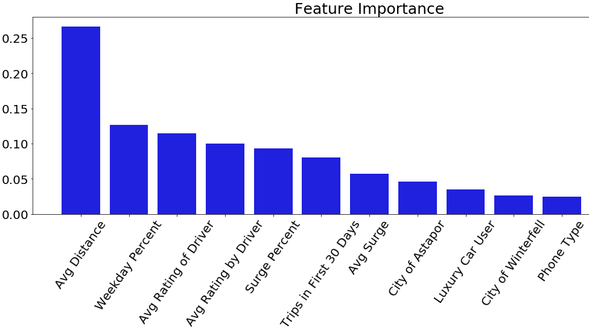

# Predicting Customer Retention Case Study

# Table of contents
1. [Motivation](#motivation)
2. [Data](#data)
3. [Feature Engineering](#feature_engineering)
4. [Exploratory Data Analysis](#EDA)
5. [Feature Importance](#featureimportance)
6. [Methods](#methods)
7. [Future Direction](#futuredirection)
8. [References](#references)

## Motivation 

This project was done as a case study while I was a Data Science Immersive student
at Galvanize in Denver, CO.  The objective was to create a model that would predict
customer retention for a ride-sharing company using their data on users
provided over a six month period.  Using the model, I was tasked with determining
which features were most influential in loss of retention and then making a plan
for how the company could use this information to increase retention.

## Data 

Here is a detailed description of the data received on each user:

* `city`: city this user signed up in phone: primary device for this user
* `signup_date`: date of account registration; in the form `YYYYMMDD`
* `last_trip_date`: the last time this user completed a trip; in the form `YYYYMMDD`
* `avg_dist`: the average distance (in miles) per trip taken in the first 30 days after signup
* `avg_rating_by_driver`: the rider’s average rating over all of their trips
* `avg_rating_of_driver`: the rider’s average rating of their drivers over all of their trips
* `surge_pct`: the percent of trips taken with surge multiplier > 1
* `avg_surge`: The average surge multiplier over all of this user’s trips
* `trips_in_first_30_days`: the number of trips this user took in the first 30 days after signing up
* `luxury_car_user`: TRUE if the user took a luxury car in their first 30 days; FALSE otherwise
* `weekday_pct`: the percent of the user’s trips occurring during a weekday

## Feature Engineering 

The data was pulled on July 1, 2014; it captures a six month period for users who
created an account in January 2014.  The company considers a user retained, or active,
if they used the ride-sharing company anytime in the 30 days before the data was
pulled; otherwise, the user is considered inactive, and not retained as a customer.  

Since I will be building a model to predict retention, I first had to create a column
for our target variable of retention that indicated whether or not a customer was
active based on if their last trip date was before or after June 1st, 2014.  

We found there were a large number of nulls, especially in the rating columns, which
makes sense considering riders are not required to rate their drivers.  We decided
to fill them using MICE, from the fancyimpute library; MICE is an iterative algorithm
based on chained equations that uses an imputation model specified separately for
each variable and involving the other variables and predictors.  MICE has shown to
be a better method for filling nulls than just replacing the nulls with the mean.

## Exploratory Data Analysis through Visualizations 

I knew that visualizing the data would help me to find patterns amongst the features.
The first violin plot in the diagram below tells us that there are more outliers in the active population for average distance traveled; these users potentially
stay active because they can use the ride-sharing company when on a business trip
that requires the user to fly into a distant airport.  In the second and third plots,
you can see that the inactive members are not necessarily inactive because of a dissatisfaction with their driver or a poor rating by their driver.  In the fourth
plot, there are more outliers amongst the inactive users for avg_surge(the average
surge level ridden duing a surge time); this suggests those customers only used
it in a bind, as most active users avoid riding when there's a high surge;
still the fifth plot shows that active users on average had a higher
percentage of surge rides than inactive users.  The sixth plot tells us that the
active members use the service often, especially the outliers, who took 120 trips
in the first 30 days. In the seventh plot, I noticed that inactive members were much more likely to use it only during the weekdays or only during the weekends; one can imagine that they might be inactive since they only used it when other transportation was not available.   

You can see in the countplot below, the population of people using the service mostly have iPhones; Android users aren't using the service either because it's not easy
to access on an Android, not well marketed to Android users, or simply because more people have iPhones than Androids.  

The real names of the cities in our data were replaced in order to conceal identity; still you can see from the countplot below that King's Landing is having much greater success in retaining its users than Astapor and Winterfell, even though the latter cities had many more users over the past six months.  To better understand why Astapor only retained about 25% of their customers from the past six months, we'd need take
a closer look at the demographics of Astapor and the ride-sharing marketing strategies
 in that city compared to King's Landing.  

The plot below shows that half of the users who were luxury car users are now inactive,
while 70% of the users who were not luxury car users are now inactive.

## Feature Importance 

To get an idea of which features are most important, I fit the data to a Random
Forest Classifier model, and used the feature importance method on my model to find
that the top five most important features in determining whether or not a user was
active in the last 30 days were:

1. Average Distance Traveled
2. Average Rating by Driver
3. Signup Date
4. Average Rating of Driver
5. City

Looking back at the exploratory data analysis, we saw that for the most part active
users had a lower average distance than non-active users, and that active users
overall had lower ratings both by the driver and for the driver.  While we wouldn't
expect these to be characteristics of an active user, we did see from the graphs
that they are defining characteristics of the average user; therefore it makes sense
that these features are most influential in determining if a user is active or
not active.

## Methods 

To determine the best method, we decided to check the average cross validation scores
on many popular classification algorithms that we thought would be relevant considering
the data. We got the average cross validation accuracy scores of:

Model | Accuracy | Std
--- | --- | ---
*XGB Classifier* | 0.792 | 0.006
*Linear SVC* | 0.728 | 0.006
*Gradient Boosting* | 0.791 | 0.006
*Logistic Regression* | 0.727 | 0.005
*KNN* | 0.762 | 0.006
*Decision Tree* | 0.708 | 0.006
*Naive Bayes* | 0.706 | 0.006
*Random Forest* | 0.760 | 0.006

The XGB Classifier shows to have the highest average accuracy so we will continue
with the XGB Classifier as our model; we also like the XGB Classifier since it includes
regression penalties for features that don't have much of an effect.  To make our
model even better, we will look at how changing hyper-parameters could improve our model.  
We did a grid-search to determine our best hyper-parameters for the XGB Classifier,
which then resulted in an accuracy score of 79.6%.

## Future Direction 

- A presentation including the following points:
  - How did you compute the target?
  - What model did you use in the end? Why?
  - Alternative models you considered? Why are they not good enough?
  - What performance metric did you use to evaluate the *model*? Why?
  - Based on insights from the model, what actionable plans do you propose to
    reduce churn?
  - What are the potential impacts of implementing these plans or decisions?
    What performance metrics did you use to evaluate these *decisions*, why?

## References 
